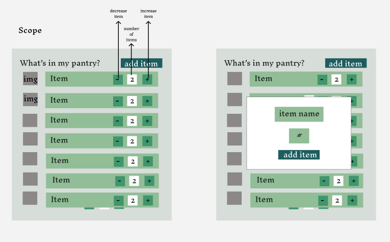

# Pantry.io

Pantry.io is an inventory management app designed to help you keep track of everything in your pantry. Whether you're managing your weekly groceries or ensuring you're stocked up on essentials, Pantry.io makes it easy to update and monitor your pantry items.

### Table of Contents
  - [Technologies](#Technologies)
  - [Installation](#Installation)
  - [Operation](#Operation)
  - [Usage](#Usage)

### Technologies

| Stack      | Dependencies   | Dev-dependancies |
| ---------- | -------------- | ---------------- |
| Python     | Django       |
| Javascript    | React, Axios, react-icons    | Webpack, Bebel, eslint    | 
| SQLite3   |          |

### Design 

Scoped and Descoped 

[Figma File Here](https://www.figma.com/design/sPlrHteZpRCyTEe3E31etM/Roulettech?node-id=0-1&t=26HJnDnVKhVIdjjt-1)




Architecture


### Installation

1. Clone the repository
    ```
    git clone https://github.com/akb3y/Roulettech.git
    ```
    or
    ```
    git clone git@github.com:akb3y/Roulettech.git
    ```
    then
    ```
    cd Roulettech
    ```

2. Start the server
    * Make sure python is installed on your machine. [Python Instructions](https://docs.python.org/3/using/index.html) 

    * Create a virtual environment
   
         ```
        python3 -m venv .venv
        source .venv/bin/activate
        ```
    * In terminal, cd into server
        ```
        cd server
        ```

    * Use the package manager [pip](https://pip.pypa.io/en/stable/) to install the dependencies

        ```
        pip install -r requirements.txt
        pip install --upgrade pip
        ```

    * Create Database
        ```
        python manage.py makemigrations
        python manage.py migrate
        ```

    * Run Sever
        ```
        python manage.py runserver 8001
        ```

3. Start the client
    * Open new terminal, cd in client
        ```
        cd client
        ```
    * Make sure [npm](https://docs.npmjs.com/) is installed and install dependencies

        ```
        npm i
        npm start
        ```

    * View in browser 

        `https://localhost:3000`

### Operation
 * Fetch All Items
 
    `GET /inventory/all/`

* Create a New Item

    `POST /inventory/create/`

* Increase Item Quantity

    `PATCH /inventory/<int:item_id>/increase/`

* Decrease Item Quantity

    `PATCH /inventory/<int:item_id>/decrease/`

* Delete task

    `DELETE /inventory/<int:item_id>/remove/`

### Usage

Main Page


Add Item


Item Added


https://github.com/user-attachments/assets/eb0b9453-2ad4-4d85-a693-56a892379f67

